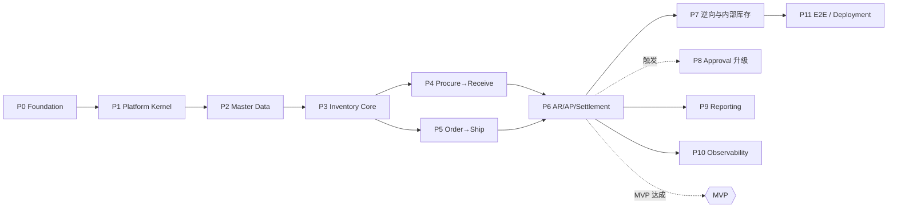

# Roadmap & Phase / Gate

> Owner: `project-bootstrap`
> 每个阶段五要素齐全：`Goal` · `Capabilities` · `Dependencies` · `Artifacts` · `Exit Criteria`（**必须可观察**）。
> **不编造日期**；团队规模未知（`Q-07`），故不给周期估算。

## 0. 相对提示词第二十八章的重排（及理由）

提示词给了 Phase 0–12 并说明「具体阶段由 Planner 根据依赖关系重新确认」。本 Roadmap 做了 **4 处实质调整**：

| 提示词 | 本 Roadmap | 理由 |
|---|---|---|
| Phase 11 Audit / Observability | **提前到 P1（平台内核）** | 审计要拦截所有写入路径。等到 11 期再补，意味着回头改动所有已实现的应用服务，且历史数据没有留痕。可观测的"结构化日志 + traceId"同理，放在 P0 基线 |
| Phase 9 Approval | **拆成两半**：内置顺序审批进 P1，可配置审批（接 `workflow-platform`）留在 P8 | 采购订单在 P4 就需要 `APPROVING` 态。但 MVP 不需要会签/并行，所以只做内置引擎；BPMN 引擎的引入条件见 `WORKFLOW_STATE_MODEL.md` §5.2 |
| Phase 0–2（需求/架构/基线）三期 | **规划两期已在本轮完成**，只保留 P0 工程基线 | Phase 0/1 的产物就是本规划包 |
| Phase 12 Integration / E2E / Deployment | **拆开**：容器化与测试数据在 P0 就要能跑（否则每期都无法真实验证），全链路 E2E 留在 P11 | 「本地能起来」是每一期验证的前提，不是终点 |

## 1. 阶段

### P0 — Foundation（工程基线与骨架）

| 要素 | 内容 |
|---|---|
| **Goal** | 有一个能编译、能启动、能连库、能跑测试、且**模块边界被机器强制**的空骨架 |
| **Capabilities** | 无业务能力（这是刻意的） |
| **Dependencies** | 本规划包获批；`Q-01`（数据库）答复 |
| **Artifacts** | 13 模块 Maven 骨架 · 工程基线文档（编码/API/错误码/日志/事务/异常/数据库/幂等 八项约定）· ArchUnit 规则 · Flyway 基线 · `compose.yaml`（仅 PostgreSQL）· `.env.example` · 健康检查 · 结构化日志 + traceId · `test-data/init-test-data.sh` 骨架 · ADR-001..004 |
| **Exit Criteria**（可观察） | ① `mvn -q verify` 退出码 0；② ArchUnit 测试**存在且能拦截**——故意加一条跨模块表访问后构建失败（负向证明）；③ `docker compose up -d && curl :8500/actuator/health` 返回 `UP`；④ 日志中可见 `traceId`；⑤ 版本兼容核验结果写入 ADR |
| 架构阶段 | Stage 1 |

### P1 — Platform Kernel（平台内核）

| 要素 | 内容 |
|---|---|
| **Goal** | 组织/权限/编号/单据模型/状态机/审计/单据图/审批端口全部可用，业务模块可以直接站在上面 |
| **Capabilities** | CAP-P01..P11、CAP-G01 |
| **Dependencies** | P0 |
| **Artifacts** | `erp-kernel` `erp-numbering` `erp-iam` `erp-approval` `erp-document` 模块 · Casdoor 接入 · 判权注解与拦截器 · MyBatis 租户/数据权限拦截器 · 状态机框架 · Outbox 框架 · 审计 AOP |
| **Exit Criteria** | ① OIDC 登录拿到 `AccessContext`；② 集成测试：无权限用户调 API 返回 403；③ 集成测试：`org_path` 数据权限生效（A 部门用户看不到 B 部门单据），且 SQL 中**确实出现**前缀条件（断言 SQL 而非断言结果）；④ 并发 50 线程取号无重复、无空洞；⑤ 非法状态迁移被拒 + 并发迁移只有一个成功；⑥ 审计记录包含前值/后值/IP/traceId；⑦ Outbox 投递失败可重试并进 DLQ |
| 架构阶段 | Stage 1 |

### P2 — Master Data（主数据）

| 要素 | 内容 |
|---|---|
| **Goal** | 商品、往来单位、仓库结构、财务基础数据可维护，且被单据引用后的修改规则生效 |
| **Capabilities** | CAP-P05、CAP-G02、CAP-G04 |
| **Dependencies** | P1 |
| **Artifacts** | `erp-masterdata` 模块 · `MasterDataRef` 快照机制 · MinIO 附件 · 导入导出 |
| **Exit Criteria** | ① 编码在租户内唯一（并发建档只成功一条）；② 停用的主数据不能被**新**单据引用，已有单据不受影响；③ 修改 SKU 名称后，历史单据显示的仍是快照值；④ 关键字段（编码、基本单位）被引用后修改被拒；⑤ 批量导入 1000 行，校验失败整批回滚 |
| 架构阶段 | Stage 1 |

### P3 — Inventory Core（库存内核）★ 本项目最关键的一期

| 要素 | 内容 |
|---|---|
| **Goal** | 库存台账、流水、预占、批次可用；任何库存变化都有来源单据且可对账 |
| **Capabilities** | CAP-C01..C04、CAP-S05（其他入库/其他出库/调整） |
| **Dependencies** | P2 |
| **Artifacts** | `erp-inventory` 模块（六边形）· `StockPostingService` · `AvailabilityCalculator` · 锁协议 · 对账脚本 |
| **Exit Criteria** | ① INV-01：随机 1000 次过账后 余额 == 流水代数和；② INV-02：并发 50 线程扣同一桶无负库存、无超卖；③ INV-04：同一来源行过账 10 次只有一次效果；④ 预占→部分消耗→释放 的数量链正确，释放不超额；⑤ 每条流水都能反查到来源单据行；⑥ `available` 无对应数据库字段（代码审查 + 架构测试）；⑦ 对账脚本在 CI 中跑通 |
| 架构阶段 | Stage 1 |

### P4 — Procure to Receive（采购到入库）

| 要素 | 内容 |
|---|---|
| **Goal** | P2P 前半链路跑通：采购申请 → 审批 → 采购订单 → 收货 → 入库 |
| **Capabilities** | CAP-C05、CAP-S09 |
| **Dependencies** | P3；`Q-09`（超收/负库存策略）答复 |
| **Artifacts** | `erp-procurement` 模块 · 采购状态机 · 超收策略 |
| **Exit Criteria** | ① E2E：申请→审批→下单→分 3 次收货→全部入库，库存增加量 == 收货总量；② 超收超过配置比例被拒，配置放开后需审批通过；③ 少收后可 `close` 剩余，且已收部分保留；④ 已收货的订单不能 `cancel`；⑤ 从入库单可反查采购订单、从采购订单可正查入库单（单据图双向）；⑥ 重复提交收货单不产生二次入库 |
| 架构阶段 | Stage 1 |

### P5 — Order to Ship（销售到出库）

| 要素 | 内容 |
|---|---|
| **Goal** | O2C 前半链路跑通：报价（可选）→ 销售订单 → 审批 → 预占 → 拣货 → 出库 → 发货 → 签收 |
| **Capabilities** | CAP-C06、CAP-S06 |
| **Dependencies** | P3（不依赖 P4，可与 P4 并行） |
| **Artifacts** | `erp-sales` 模块 · 销售状态机 · 信用占用 |
| **Exit Criteria** | ① E2E：下单→审批→预占→分 2 批出库→发货→签收，库存减少量 == 出库总量且预占归零；② 库存不足时预占失败且订单停在 `APPROVED`；③ 取消订单释放全部未消耗预占（断言预占表与余额同时正确）；④ 信用超限被拦截，审批放行后可下单；⑤ 部分出库后剩余量可继续出 |
| 架构阶段 | Stage 1 |

### P6 — AR / AP / Settlement（应收应付与核销）★ MVP 完成点

| 要素 | 内容 |
|---|---|
| **Goal** | **两条闭环闭合**：入库→应付→付款→核销；出库→应收→收款→核销 |
| **Capabilities** | CAP-C07..C09 |
| **Dependencies** | P4 + P5 |
| **Artifacts** | `erp-finance` 模块 · `SettlementService` · Outbox 消费者 |
| **Exit Criteria** | ① E2E P2P 全闭环走通；② E2E O2C 全闭环走通；③ INV-06：同一入库单事件投递 10 次只生成一张应付；④ INV-07：超额付款被拒、重复核销被拒、超额核销被拒；⑤ 反核销后金额回到核销前且留有反向记录；⑥ Outbox 滞后 P95 ≤ 60s（本地观测）；⑦ **每笔应付/应收都能追溯到源头采购/销售订单**（单据图端到端） |
| 架构阶段 | Stage 1 · **MVP 达成** |

### P7 — 逆向与内部库存业务

| 要素 | 内容 |
|---|---|
| **Goal** | 退货、调拨、盘点、报损报溢闭合；库存有合法的纠错手段 |
| **Capabilities** | CAP-S01..S05、CAP-S10 |
| **Dependencies** | P6 |
| **Artifacts** | 退货单 · 调拨单（含在途）· 盘点单 · 调整单 · 计价 |
| **Exit Criteria** | ① 采购退货冲减应付且库存减少；② 销售退货入库且冲减应收，**退货入库需重新指定批次**；③ INV-08：调拨全流程后企业维度数量守恒（含在途）；④ 盘点差异必须审批后才落账；⑤ 移动加权成本在多次入库后计算正确，出库结转正确 |
| 架构阶段 | Stage 1 |

### P8 — Approval 升级（条件触发，非必经）

| 要素 | 内容 |
|---|---|
| **Goal** | 支持可配置审批流（会签/或签/加签/转交/并行） |
| **Capabilities** | CAP-I01 |
| **Dependencies** | P6；**触发条件**：出现真实的会签或并行审批需求 |
| **Artifacts** | `WorkflowPlatformApprovalAdapter` · Outbox→Kafka · Inbox · DLQ · 对账脚本 |
| **Exit Criteria** | ① 切换适配器后，P4/P5 的审批 E2E 仍然通过（内置适配器保留为回落）；② 引擎侧"已受理 202"不得在 ERP UI 呈现为"已完成"；③ 重复回执不产生二次业务效果；④ 对账脚本能发现 ERP 待审实例与平台实例的差异 |
| 架构阶段 | Stage 1（引入首个跨系统异步依赖） |

### P9 — Reporting（报表与查询模型）

| 要素 | 内容 |
|---|---|
| **Goal** | 报表走读模型，不实时 JOIN 几十张业务表 |
| **Capabilities** | CAP-A01..A05 |
| **Dependencies** | P6（需要真实数据谈口径，`U-02`） |
| **Artifacts** | `erp-reporting` 读模型表 · 投影器 · **重建脚本** |
| **Exit Criteria** | ① 库存余额报表与台账口径一致（同一时点数值相等）；② 读模型可从权威数据全量重建且结果一致；③ 报表查询 P95 < 1s（在 A-04/A-05 规模的种子数据下）；④ 报表 SQL 中不出现业务表 |
| 架构阶段 | Stage 1 → 触发时 Stage 2 |

### P10 — Observability 加固

| 要素 | 内容 |
|---|---|
| **Goal** | 可排障、可度量 |
| **Capabilities** | NFR-05 增强 |
| **Dependencies** | P6 |
| **Artifacts** | Micrometer 指标 · 慢查询日志 · Outbox 积压指标 · 业务指标（库存守恒、核销差异）· 告警规则 |
| **Exit Criteria** | ① 关键业务日志可按 `tenantId/userId/businessType/businessId/documentNo/traceId` 检索到；② 库存守恒与 Outbox 积压有指标且有告警阈值；③ 告警指向可执行的处置步骤（不是"CPU 高"） |
| 架构阶段 | Stage 1 |

### P11 — Integration / E2E / Deployment

| 要素 | 内容 |
|---|---|
| **Goal** | 一键起环境、一键灌数据、全链路 E2E 绿 |
| **Capabilities** | NFR-11、NFR-12 |
| **Dependencies** | P7 |
| **Artifacts** | 完整 `compose.yaml` · `test-data/init-test-data.sh`（覆盖租户→公司→组织→部门→员工→用户→角色→供应商→客户→商品→SKU→仓库→库位→库存→采购→销售→应收→应付→付款→收款）· E2E 套件 · 部署与运维文档 |
| **Exit Criteria** | ① `docker compose up -d` 后 5 分钟内全部健康；② `init-test-data.sh` 可重复执行、可清理、可验证；③ **Mock 数据全部入库，前端无硬编码**（全局开发规范 §三，由代码扫描证明）；④ E2E 覆盖 P2P 与 O2C 全闭环并在 CI 中绿；⑤ compose 中**不包含未使用的中间件** |
| 架构阶段 | Stage 1 |

## 2. 依赖图

P4 与 P5 可并行（都只依赖 P3，且不互相依赖）。

## 3. Gate 定义

### 3.1 每个 Phase 的 Gate 检查项（提示词第二十九章）

**「代码已经写完」不是完成标准。** 每个 Gate 逐项判定，取值 `PASS` / `PASS_WITH_ASSUMPTIONS` / `FAIL` / `SKIPPED(原因)` / `UNVERIFIED`。
**未执行的检查一律写 `UNVERIFIED`，不得写 `PASS`。**

| # | 检查 | 证据来源 | 谁判定 |
|---|---|---|---|
| G-01 | Requirement Complete | 本期能力在 `CAPABILITY_MAP.md` 有 ID，且 `BRIEF.md` 的相关不变量已列出 | `public-engineering-workflow` |
| G-02 | Domain Model Complete | `DOMAIN_MAP.md` 中本期聚合的不变量已写出并在代码中有对应校验 | `backend-architecture-design` |
| G-03 | Architecture Valid | 本期未引入未经 Complexity Budget 的组件；未新增可部署单元 | `backend-architecture-design` |
| G-04 | Implementation Complete | 本期 ChangeSet 全部 `SUCCEEDED` | Runtime |
| G-05 | Unit Test Pass | `mvn -q test` 退出码 0 + 报告 | `implementation-validation` |
| G-06 | Integration Test Pass | Testcontainers PostgreSQL 集成测试通过（**不接受纯 Mock 证明事务正确**） | `implementation-validation` |
| G-07 | Architecture Test Pass | ArchUnit 全绿；**且负向用例证明规则确实会拦截** | `implementation-validation` |
| G-08 | Regression Pass | 之前各期的 E2E 与不变量测试仍然绿 | `implementation-validation` |
| G-09 | Evidence Complete | 每条 PASS 都能回答「为什么 PASS」与「证据在哪」（命令、退出码、报告路径） | `ci-cd-gate` |
| G-10 | Documentation Updated | 本期涉及的架构文档与 ADR 已更新；`PROGRESS_STATE` 已回写 | `doc-sync` / `update-progress-docs` |

### 3.2 阶段专属的阻断项

除 G-01..G-10 外，下列各期**额外**必须 PASS，否则不得进入下一期：

| Phase | 额外阻断项 |
|---|---|
| P0 | ArchUnit 负向用例（故意违规必须构建失败）；版本兼容核验写入 ADR |
| P1 | 数据权限**下推到 SQL** 的断言（断言生成的 SQL，不只断言返回结果） |
| P3 | INV-01 / INV-02 / INV-04 全部由**真实数据库**集成测试证明 |
| P4/P5 | 单据图双向可追溯的 E2E 断言 |
| P6 | INV-06 / INV-07 的幂等与不超额断言；两条闭环 E2E |
| P7 | INV-08 企业维度守恒断言 |
| P9 | 读模型重建后与权威数据一致 |
| P11 | Mock 数据无硬编码（代码扫描）；compose 无未使用中间件 |

### 3.3 与本工程体系机器 Gate 的映射

| 本 Roadmap | `ROUTER_CONTEXT.phase_gates` |
|---|---|
| 本规划包（已完成） | `requirement`, `architecture` |
| P0 出口 | `engineering_baseline` |
| P1 出口 | `bootstrap` |
| P2–P7 各期出口 | `implementation`（逐期） |
| 各期验证 | `verification`（逐期） |

> **写产品代码的 ChangeSet 在 Router 处需要 `engineering_baseline` 为 PASS。** 因此 P0 的工程基线 ChangeSet 带 `metadata.establishesGate: engineering_baseline`，否则后续 ChangeSet 不可达。

### 3.4 Gate 的硬规则

1. 未过 Gate 不得进入下一阶段（提示词第三十章第 16 条）。
2. Build / Test 失败不得标记完成。
3. 未跑过的检查写 `UNVERIFIED` 或 `SKIPPED + 原因`，**永不写 `PASS`**。
4. Assumption 不得写成 Fact。
5. NFR-07（RPO/RTO）在完成真实恢复演练前只能是 `ASSUMED`。
