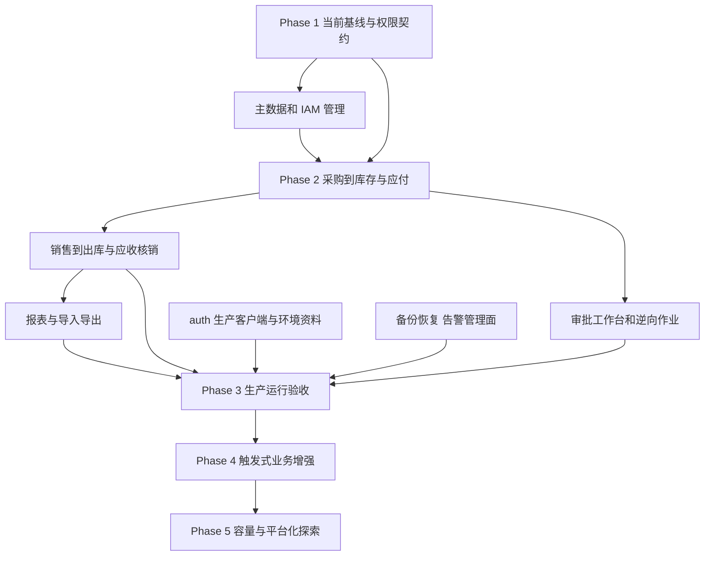

> 日期：2026-09-23；protocol: `capability-exploration-report/v1`；baseline: `engineering-baseline/v1`。
> explorationSummary：现状：业务内核和本地工程验证较完整，面向真实用户的 ERP 产品入口与生产运行闭环仍不完整。优先补齐业务 API/页面、可信授权与主数据管理、生产运行验收；暂不拆微服务或新增无实际需求的中间件。

# Evolution Roadmap

## Evolution Principles

先形成可用的纵向业务链，再补运维和按需增强；复用现有领域服务、PostgreSQL、身份平台、验证设施。认证由 auth-platform、业务授权由 ERP 负责。无依据不重选框架、不引入新中间件、不扩张 ERP 到完整会计系统。本轮只提出建议，不改正式架构/契约，不执行路线。

原 P0…P11 是旧执行计划的阶段编号；下列 Phase 是本报告建议的后续顺序。旧阶段出口通过不等于原能力目录全部交付，P8 未触发也不等于必须立即实施。

## Capability Dependencies

## Phase 1 · 确认可验证基线及业务边界

对应 O02/O03/O13。先确认实际实施版本及验证状态，再补当前能力索引。沿现有契约定义服务器可信入参：租户/操作者取已验证上下文，客户信用/主数据快照取权威库；明确公司与仓库可访问集合及写操作规则。补全优先实体的维护入口和角色数据范围配置。

出口：新接口权限清单、角色/组织/仓库边界可测；主数据引用限制明确；必要回归基于确切版本通过。不要先做漂亮页面再补安全边界。

## Phase 2 · 可使用的 ERP 纵向闭环

对应 O01/O05/O08。按完整逻辑单元连续推进：

1. 供应商/SKU/仓库→采购下单→审批→分批收货→库存查询→应付查询。
2. 客户/信用→销售→审批/预占→分批出库→应收→收款/付款→核销/反核销。
3. 采购/销售退货、退款、调拨/盘点/调整的操作页面、权限和业务反馈。
4. 单据关系与审计查询，五类报表快照展示/刷新状态/授权下载，按用户需要补文件导入。

每个切片包含 HTTP DTO/校验、真实后端页面、权限、幂等/非法状态/失败反馈测试与文档。界面从接口取数据，不硬编码 Mock。复用数据库种子工具准备示例。

出口：真实 OIDC 角色可在浏览器完成采购和销售两条完整业务链；缺权限和跨租户/公司/仓库访问被拒；重复提交不产生重复库存或资金效果；列表/报表权限和业务记录一致。不能只运行 Java 服务测试宣布此阶段完成。

## Phase 3 · 生产启用门槛（准备可与 Phase 2 并行）

对应 O04，历史数据存在时纳入 O09。本次不部署。

- auth 项目依据真实 HTTPS 域名生成生产 OIDC 客户端及回调；ERP 接收公开配置并验证登录、刷新、错误 issuer/audience/owner、禁用用户等路径。凭据经受控机制投放。
- 限制管理指标入口；确定告警接收方并演练触发、送达、恢复。
- 在隔离恢复目标验证备份可恢复、依赖齐备、关键业务与积压可继续；明确发布、代码回退和业务补偿的不同边界。
- 若迁移历史 v1 数据，先盘点数量和可信金额来源；没有来源就保留缺失状态，不猜金额，不覆盖原账。

出口：目标环境配置、身份、恢复、告警、发布回退的证据绑定同一交付版本；SLO/RPO/RTO 由实际目标和实测确定。没有生产域名/目标/责任人时，环境相关项保持 BLOCKED，不妨碍 Phase 1/2 的本地工作。

## Phase 4 · 按实际业务补齐

O06 预占过期（先确认有效期），O07 采购申请（有内控要求时），O08 附件，O12 报价/供应商对账，O10 运维操作和数据保留。

出口：每项有独立触发条件、领域规则、权限、失败恢复和验收；依赖清楚后才转正式设计与实施切片。不要为完成能力目录而引入未确认的业务流程。

## Phase 5 · 有证据的规模演进

对应 O11，复用已有报表基准扩展真实混合负载、热点并发、持续更新、多实例与租户公平性测试。根据实测定位 SQL、锁、批次或资源瓶颈，再选择局部优化。无需预先承诺拆服务或引入缓存/MQ。

出口：实测范围、数据分布、SLO、瓶颈、成本与恢复结果完整；3x/10x/100x 都是实验场景，不是已具备能力。

## Future Exploration

复杂工作流、经营概览、外部银行/税务与 AI 辅助按各自真实需求重新评估。优先用现有平台契约复用，不另造认证、工作流或通用平台。

### Handoff（skill-contract/v1）

- status：分析完成；未进入实施。
- artifacts：本目录五文件，入口 [CAPABILITY_MAP](CAPABILITY_MAP.md)。
- decisions：建议优先 O01/O02/O03；生产准备 O04 并行，但真实发布仍取决于目标环境与授权。
- unresolved：生产环境/域名、订单到期规则、历史数据及来源、外部已有运维设施、真实容量目标。
- nextAction：以本报告作为候选输入，按优先链路形成或补充正式契约及实施切片；不是另起一轮总体架构设计。
- limitations：本次静态探索，不是安全审计 PASS、测试 PASS 或生产 READY 证明。
