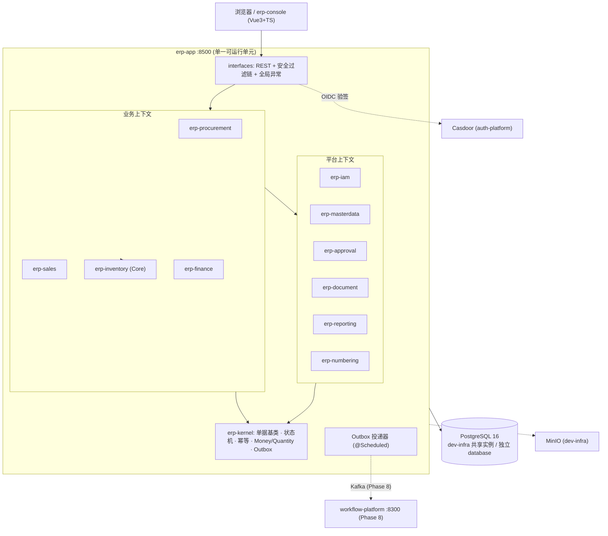
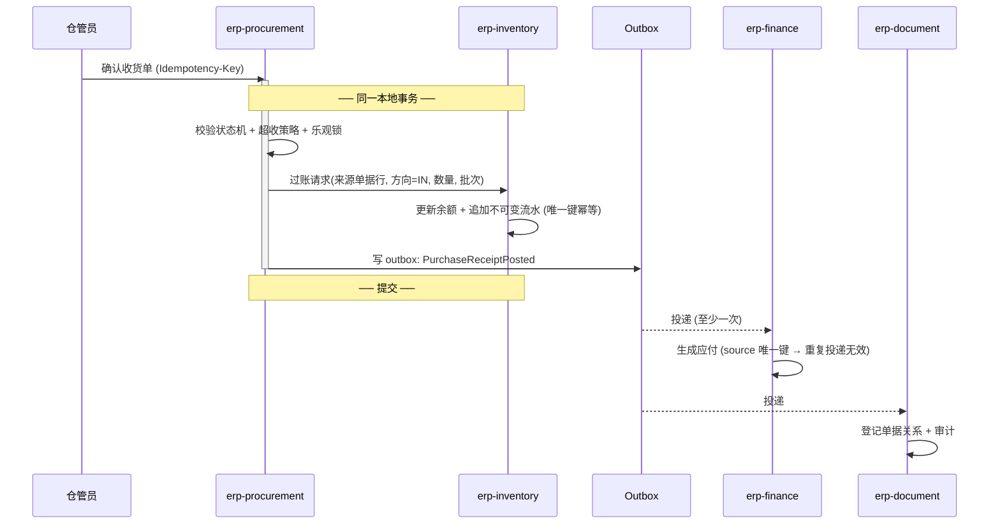

# BACKEND_ARCHITECTURE — erp-platform

> Owner: `backend-architecture-design` · 委托方 `project-bootstrap`（`GREENFIELD_PLANNING`）
> 本文件是**索引 + 目标架构**，是唯一 `ref`；细节在 `architecture/` 下分章节。

## 1. 目标架构一句话

> **模块化单体 + 9 个清晰限界上下文 + 单 PostgreSQL + 局部事件驱动 + 可演进服务边界。**
> 强一致的不变量（单据↔库存↔往来账）留在一次本地事务里；只有"提交后必须可靠发生"的副作用走同库 Outbox。

## 2. 运行时视图

## 3. 核心流程（采购到付款，一次请求的事务边界）

要点：**库存过账与单据更新同事务**（INV-01/03 的前提）；**应付生成异步但幂等**（INV-06 由唯一键保证，不是靠"只投一次"）。

## 4. 章节索引

| 章节 | 文件 | 回答什么 |
|---|---|---|
| 领域地图 | [`architecture/DOMAIN_MAP.md`](architecture/DOMAIN_MAP.md) | 子域分类、聚合与不变量、哪些上下文**不用**战术模式 |
| **限界上下文图** | [`architecture/BOUNDED_CONTEXT_MAP.md`](architecture/BOUNDED_CONTEXT_MAP.md) | 9 个上下文、数据所有权、Context Map 与关系模式、主数据快照规则 |
| 架构选项与决策 | [`architecture/ARCHITECTURE_OPTIONS.md`](architecture/ARCHITECTURE_OPTIONS.md) | 单体 vs 微服务的逐项依据、DEC-01/02/03 |
| 架构演进 | [`architecture/ARCHITECTURE_EVOLUTION.md`](architecture/ARCHITECTURE_EVOLUTION.md) | Stage 1→4 的**可观察触发条件**、抽取优先级 |
| 模块图 | [`architecture/MODULE_SERVICE_MAP.md`](architecture/MODULE_SERVICE_MAP.md) | 13 个模块、依赖规则、与提示词候选结构的 6 处差异 |
| 数据架构 | [`architecture/DATA_ARCHITECTURE.md`](architecture/DATA_ARCHITECTURE.md) | 组件判定、权威与事务边界、类型精度、索引、迁移 |
| 集成架构 | [`architecture/INTEGRATION_ARCHITECTURE.md`](architecture/INTEGRATION_ARCHITECTURE.md) | 5 个 Port、外部依赖的超时/重试/幂等/对账、ACL 职责 |
| 安全架构 | [`architecture/SECURITY_ARCHITECTURE.md`](architecture/SECURITY_ARCHITECTURE.md) | 认证外包/授权自建、判权执行路径、审计内容 |
| 一致性模型 | [`architecture/CONSISTENCY_MODEL.md`](architecture/CONSISTENCY_MODEL.md) | 11 个场景的一致性范围与手段、幂等对照表、并发锁协议 |
| 流程与状态 | [`architecture/WORKFLOW_STATE_MODEL.md`](architecture/WORKFLOW_STATE_MODEL.md) | 统一机制/各自状态集、5 个聚合状态机、审批中心与可插拔引擎 |
| 技术选型 | [`TECH_SELECTION.md`](TECH_SELECTION.md) | 选型表、与建议栈的 4 处差异、Complexity Budget、Build/Buy/Integrate |

## 5. 架构不变量（ArchUnit 在 Phase 0 强制）

1. 模块依赖单向无环：`kernel ← numbering ← iam ← masterdata ← {inventory} ← {procurement, sales, finance} ← app`
2. 跨模块不得访问对方表前缀
3. 领域层不依赖 Spring Web / MyBatis 注解（仅 Core 上下文）
4. Controller 不依赖 Mapper
5. 应用层与领域层不出现 SQL 字符串
6. 领域对象不跨模块传递
7. `inventory` 不依赖 `procurement` / `sales` / `finance`

## 6. 本架构尚未回答的（交 Planner / 用户）

- `Q-01` 数据库选型确认（PG16 vs MySQL8.4）
- `Q-02` 库位精度、`Q-03` WMS 边界、`Q-04` 租户隔离级别、`Q-05` 计价方法、`Q-09` 超收与负库存策略
- 版本兼容核验（`TECH_SELECTION.md` §5 最后一项）
- **CONTRACTS 阶段**才产出的：具体 API 路径、错误码表、事件 schema、字段级校验
