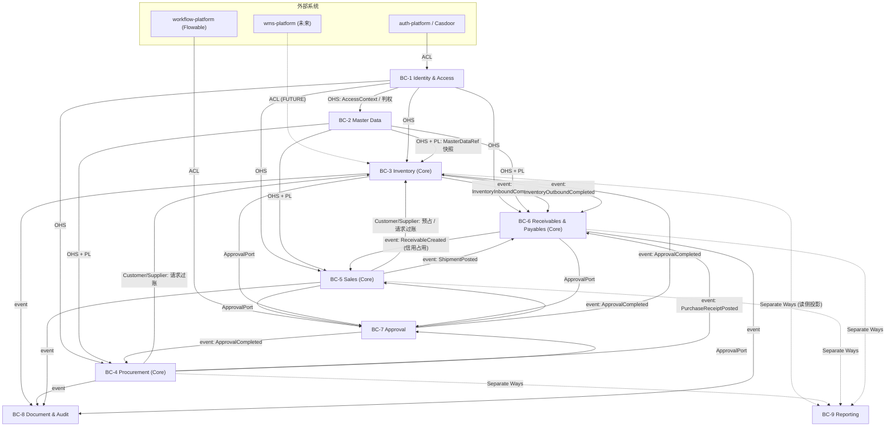

# Bounded Context Map

> Owner: `backend-architecture-design`
> **限界上下文是逻辑边界，不等于默认独立进程。** 部署形态见 [`ARCHITECTURE_OPTIONS.md`](ARCHITECTURE_OPTIONS.md)。

## 1. 上下文清单

| # | Bounded Context | 统一语言核心词 | 子域 | 拥有的数据（Source of Truth） | 对外提供的能力 |
|---|---|---|---|---|---|
| BC-1 | **Identity & Access**（身份与访问） | 租户、公司、组织、部门、员工、用户、角色、权限、数据范围 | Generic | `tenant` `company` `org_unit` `org_closure` `employee` `user` `role` `permission` `role_permission` `user_role` `data_scope` | 判权 API、`AccessContext` 解析、组织树查询 |
| BC-2 | **Master Data**（主数据） | SPU、SKU、类目、品牌、计量单位、条码、属性、供应商、客户、币种、税率、结算方式、银行账户、会计科目 | Supporting | `product_spu` `product_sku` `category` `brand` `uom` `barcode` `attribute` `supplier` `customer` `partner_contact` `currency` `tax_rate` `settlement_method` `bank_account` `accounting_subject` | 主数据查询、`MasterDataRef` 快照签发、引用校验 |
| BC-3 | **Inventory**（库存） | 仓库、库区、库位、批次、库存桶、在手、可用、预占、锁定、在途、流水、过账 | **Core** | `warehouse` `warehouse_area` `warehouse_location` `inventory_batch` `inventory_balance` `inventory_transaction` `inventory_reservation` `stock_document` | 过账、预占/释放、可用量查询、余额与流水查询 |
| BC-4 | **Procurement**（采购） | 采购申请、采购订单、收货、入库、退货、超收、少收、关闭 | **Core** | `purchase_request` `purchase_order` `purchase_order_line` `purchase_receipt` `purchase_return` | 采购单生命周期、收货执行 |
| BC-5 | **Sales**（销售） | 报价、销售订单、预占、拣货、出库、发货、签收、退货、信用占用 | **Core** | `quotation` `sales_order` `sales_order_line` `shipment` `sales_return` `customer_credit_account` | 销售单生命周期、发货执行、信用校验 |
| BC-6 | **Receivables & Payables**（往来账与结算） | 应收、应付、收款、付款、核销、反核销、对账 | **Core** | `account_receivable` `account_payable` `receipt` `payment` `settlement_record` `reconciliation_statement` | 往来账生成、收付款、核销 |
| BC-7 | **Approval**（审批） | 审批定义、审批实例、节点、任务、动作、记录 | Supporting | `approval_definition` `approval_instance` `approval_node` `approval_task` `approval_record` | `ApprovalPort`：提交/审批/驳回/撤回/转交/加签/抄送 |
| BC-8 | **Document & Audit**（单据链与审计） | 单据关系、来源、去向、操作日志、变更日志 | Supporting | `document_link` `operation_log` `audit_log` `business_change_log` | 单据溯源（上游/下游）、审计查询 |
| BC-9 | **Reporting**（报表） | 余额报表、流水报表、统计、账龄、概览 | Supporting | `rpt_*` 读模型表（**派生数据，非权威**） | 报表查询 |

### 不是限界上下文的两个平台件（明确声明）

| 名称 | 是什么 | 为什么不是 BC |
|---|---|---|
| `erp-kernel` | 共享内核库：统一单据基类、**状态机机制**、幂等框架、`Money`/`Quantity` 值对象、错误码、`AccessContext`、Outbox 框架 | 它没有自己的业务语言与数据所有权，是被所有 BC 复用的**机制**。范围刻意保持很小（Shared Kernel 的代价是耦合发布） |
| `erp-numbering` | 编号中心：`tenant + businessType + date + sequence` | 单一不变量（唯一、可读、并发安全），由数据库序列/号段保证；建一个 BC 只会增加一次跨边界调用 |

> **状态机是机制统一、状态集合各自拥有**：`erp-kernel` 提供迁移表 + 守卫 + 动作 + 迁移日志 + 乐观锁；`PurchaseOrder` 与 `InventoryBalance` 的状态集合完全不同，各自在自己的 BC 内注册。不存在一张「万能状态表」。

## 2. Context Map



## 3. 关系明细

| 上游 | 下游 | 模式 | 理由 | 代价与对策 |
|---|---|---|---|---|
| BC-1 Identity | BC-2..BC-6 | **Open Host Service** | 判权与 `AccessContext` 被所有上下文以同一方式使用，必须一个入口 | 接口需版本化；`AccessContext` 保持为窄值对象，不暴露组织表结构 |
| BC-2 Master Data | BC-3..BC-6 | **Open Host Service + Published Language** | 商品/往来/财务基础数据被所有业务域引用，需要稳定契约 | 契约演进成本。对策见下方「主数据快照规则」 |
| BC-4 Procurement | BC-3 Inventory | **Customer / Supplier** | 采购是库存的客户：请求入库过账；库存的接口需求能影响采购的排期 | 需双方协商过账契约；库存**不为采购定制规则** |
| BC-5 Sales | BC-3 Inventory | **Customer / Supplier** | 同上（预占 + 出库过账） | 同上 |
| BC-3 Inventory | BC-6 AR/AP | 领域事件（Outbox） | 过账完成后才产生往来账；金额计算归 BC-6，库存不懂钱 | 最终一致 ≤ 60s；靠 INV-06 唯一键幂等 |
| BC-4 / BC-5 | BC-6 AR/AP | 领域事件（Outbox） | 收货/发货是往来账的业务来源 | 同上 |
| BC-6 AR/AP | BC-5 Sales | 领域事件 | 应收余额变化会改变客户信用占用 | 信用占用最终一致；下单时的硬校验读 BC-6 的当前值，不读缓存 |
| 全部业务 BC | BC-7 Approval | **Open Host Service**（`ApprovalPort`，以 `businessType + businessId` 接入） | 审批被多个域以同一方式使用；业务模块不得各写一套审批 | 审批实例状态**不是**业务状态权威，回调经 `ApprovalCompleted` 事件，由业务聚合自行迁移 |
| 全部业务 BC | BC-8 Document & Audit | 领域事件 | 单据关系与审计必须解耦登记，否则每个模块都要感知图结构 | 登记失败不回滚主事务，但进 Outbox 重试，可补偿 |
| 全部业务 BC | BC-9 Reporting | **Separate Ways**（写侧） | 报表不得反向影响业务模型；读模型由事件与台账投影 | 读模型是派生数据，重建脚本必须存在 |
| Casdoor / auth-platform | BC-1 | **Anti-Corruption Layer** | 外部身份模型（Casdoor 的 org/group）不得污染 ERP 的组织与数据权限模型 | 维护翻译层；ERP 只取 subject/claims，组织与角色留在 ERP |
| workflow-platform | BC-7 | **Anti-Corruption Layer** | Flowable/BPMN 的任务与流程变量模型不得进入 ERP 审批模型 | 适配器隔离；MVP 不启用（见 A-12） |
| wms-platform | BC-3 | **Anti-Corruption Layer**（未来） | WMS 的 `owner/location/quality/serial` 模型与 ERP 台账维度不同 | 端口预留，见 `Q-03` |

## 4. 两条必须写死的跨边界规则

### 4.1 主数据快照规则（防止"改了主数据，历史单据全变了"）

业务单据行**不持有主数据的实时引用**，而是在创建时嵌入 `MasterDataRef` 值对象快照：

```text
MasterDataRef { id, code, name, version, snapshotAt }
```

- 主数据的**关键字段**（编码、基本计量单位、SKU↔SPU 归属）被单据引用后**冻结**，只能停用不能改。
- 描述性字段可改，历史单据展示快照值，不回刷。
- 停用不影响已有单据，只阻止**新的**引用。
- 依据：与 `oa-platform` 的 `org_path` 快照同一原则——**发生时快照，不随主数据调整回刷**，既是性能也是正确语义。

### 4.2 数据所有权规则

> **Data Ownership follows Domain Ownership.**

- 跨上下文**禁止**直接读写对方的业务表（提示词第三十章禁止事项 5/6）。
- 跨上下文读取只有三条合法路径：① 调用对方应用服务；② 订阅对方已发布的领域事件；③ 查询显式设计的只读投影（BC-9）。
- 该规则在 Phase 0 由 **ArchUnit 架构测试**强制，违反即构建失败，不靠人自觉。
